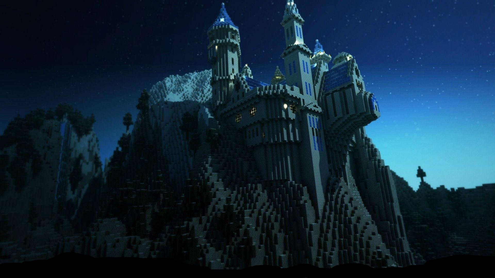

<div align="center">



# 🌑 THE WARRIOR DEVELOPER 🌑


[](https://github.com/generalBenmalek)

</div>

---

<div align="center">

## ⚔️ CHARACTER STATS

</div>

```ascii
╔═══════════════════════════════════════════════════════════════╗
║                                                               ║
║  👤 NAME:    Benmalek Mohamed Aymen                           ║
║  🎯 CLASS:   Game Development Seeker                          ║
║  ⭐ LEVEL:   Ascending Warrior                                ║
║  💎 RUNES:   Gathering Knowledge                              ║
║                                                               ║
╚═══════════════════════════════════════════════════════════════╝

```

<div align="center">

### 🗡️ HARD SKILLS (Combat Attributes)

<table>
<tr>
<td width="50%" valign="top">

#### ⚡ Primary Arsenal
```text
Lua             ████████████████░░░░  85%
JavaScript      ███████████████░░░░░  78%
Node.js         ███████████████░░░░░  75%
C++             ██████████████░░░░░░  70%
Dart            ██████████████░░░░░░  70%
```

</td>
<td width="50%" valign="top">

#### 🛡️ Secondary Mastery
```text
MongoDB         ██████████████░░░░░░  70%
Roblox Studio   █████████████░░░░░░░  69%
Flutter         █████████████░░░░░░░  65%
Python          ████████████░░░░░░░░  60%
React           ███████████░░░░░░░░░  55%
```

</td>
</tr>
</table>

### 🛡️ SOFT SKILLS (Resistances)

<table>
<tr>
<td align="center" width="20%">

<br><b>Creativity</b>
<br><code>████████░░ 80%</code>
</td>
<td align="center" width="20%">

<br><b>Problem Solving</b>
<br><code>███████░░░ 75%</code>
</td>
<td align="center" width="20%">

<br><b>Adaptability</b>
<br><code>███████░░░ 75%</code>
</td>
<td align="center" width="20%">

<br><b>Teamwork</b>
<br><code>█████░░░░░ 55%</code>
</td>
<td align="center" width="20%">

<br><b>Communication</b>
<br><code>█████░░░░░ 50%</code>
</td>
</tr>
</table>

</div>

---

<div align="center">

## 📊 BATTLE STATISTICS

<picture>
  <source media="(prefers-color-scheme: dark)" srcset="https://raw.githubusercontent.com/generalBenmalek/generalBenmalek/output/github-contribution-grid-snake-dark.svg">
  <source media="(prefers-color-scheme: light)" srcset="https://raw.githubusercontent.com/generalBenmalek/generalBenmalek/output/github-contribution-grid-snake.svg">
  
</picture>

<br><br>

<table align="center" border="0">
<tr border="0">
<td width="50%" align="center" border="0">

  

</td>
<td width="50%" align="center" border="0">

  

</td>
</tr>
<tr border="0">
<td colspan="2" align="center" border="0">

  

</td>
</tr>
</table>

<br>


</div>

---

<div align="center">

## 🎮 LEGENDARY QUESTS (Featured Projects)

<table>
<tr>
<td width="50%">

<h3 align="center">⚡ YACK - Your Agreement Contract Keeper</h3>

<div align="center">

[](https://github.com/generalBenmalek/YACK)

**Epic Tier** • Security App

`Flutter` `Firebase` `Hashing`

A secure mobile app for creating and signing digital contracts with data integrity verification.

</div>

</td>
<td width="50%">

<h3 align="center">🔥 World of Elements Battle Ground</h3>

<div align="center">

[](https://github.com/generalBenmalek/WorldOfElements)

**Epic Tier** • Roblox Game

`Roblox` `Lua` `Game Design`

Fighting game featuring elemental classes and dynamic combat mechanics.

</div>

</td>
</tr>
<tr>
<td width="50%">

<h3 align="center">👻 OurJoy</h3>

<div align="center">

[](https://github.com/generalBenmalek/OurJoy)

**Rare Tier** • Horror Adventure

`Roblox` `Game Design` `Horror`

Horror-adventure game set in a surgical facility with puzzles and traps.

</div>

</td>
<td width="50%">

<h3 align="center">🎨 ColorTris</h3>

<div align="center">

[](https://github.com/generalBenmalek/ColorTris)

**Epic Tier** • Puzzle Game

`JavaScript` `HTML` `CSS`

Tetris-inspired puzzle game with smooth animations and color-matching.

</div>

</td>
</tr>
</table>

</div>

---

<div align="center">

## 🗂️ INVENTORY (Tech Arsenal)

### ⚔️ Weapons of Choice

<table>
<tr>
<td align="center" width="12.5%">

<br><b>Lua</b>
<br><sub>⭐⭐⭐⭐⭐</sub>
<br><code>Legendary</code>
</td>
<td align="center" width="12.5%">

<br><b>JavaScript</b>
<br><sub>⭐⭐⭐⭐</sub>
<br><code>Epic</code>
</td>
<td align="center" width="12.5%">

<br><b>Node.js</b>
<br><sub>⭐⭐⭐⭐</sub>
<br><code>Epic</code>
</td>
<td align="center" width="12.5%">

<br><b>C++</b>
<br><sub>⭐⭐⭐</sub>
<br><code>Rare</code>
</td>
<td align="center" width="12.5%">

<br><b>Python</b>
<br><sub>⭐⭐⭐</sub>
<br><code>Rare</code>
</td>
<td align="center" width="12.5%">

<br><b>Dart</b>
<br><sub>⭐⭐⭐</sub>
<br><code>Rare</code>
</td>
<td align="center" width="12.5%">

<br><b>Flutter</b>
<br><sub>⭐⭐⭐</sub>
<br><code>Rare</code>
</td>
<td align="center" width="12.5%">

<br><b>MongoDB</b>
<br><sub>⭐⭐⭐</sub>
<br><code>Rare</code>
</td>
</tr>
<tr>
<td align="center" width="12.5%">

<br><b>React</b>
<br><sub>⭐⭐</sub>
<br><code>Uncommon</code>
</td>
<td align="center" width="12.5%">

<br><b>HTML</b>
<br><sub>⭐⭐⭐</sub>
<br><code>Rare</code>
</td>
<td align="center" width="12.5%">

<br><b>CSS</b>
<br><sub>⭐⭐⭐</sub>
<br><code>Rare</code>
</td>
<td align="center" width="12.5%">

<br><b>Firebase</b>
<br><sub>⭐⭐</sub>
<br><code>Common</code>
</td>
<td align="center" width="12.5%">

<br><b>Git</b>
<br><sub>⭐⭐</sub>
<br><code>Common</code>
</td>
<td align="center" width="12.5%">

<br><b>GitHub</b>
<br><sub>⭐⭐</sub>
<br><code>Common</code>
</td>
<td align="center" width="12.5%">

<br><b>VS Code</b>
<br><sub>⭐⭐</sub>
<br><code>Common</code>
</td>
<td align="center" width="12.5%">

<br><b>Figma</b>
<br><sub>⭐⭐</sub>
<br><code>Common</code>
</td>
</tr>
</table>

</div>

---

<div align="center">

## 🏆 ACHIEVEMENTS & TROPHIES


</div>

---

<div align="center">

## 📜 QUEST LOG (Recent Activity)

<!--START_SECTION:activity-->
<!--END_SECTION:activity-->

</div>

---

<div align="center">

## 🌟 EQUIPPED RUNES (Tech Stack)

### 💻 Programming Languages


### 🚀 Frameworks & Libraries


### 🗄️ Databases & Backend


### 🛠️ Tools & Platforms


### 🎮 Game Development


</div>

---

<div align="center">

## 🗺️ SUMMON THE WARRIOR

### 📧 Send Raven Message

[](mailto:mohamed.aymen.benmalek@example.com)

### 🔗 Way Stones (Connect)

[](https://github.com/generalBenmalek)
[](https://generalbenmalek.github.io/generalBenmalek/)

<br>

```ascii
╔══════════════════════════════════════════════════════════════════════════╗
║                                                                          ║
║   ⚔️  "A game is where imagination meets creation —                      ║
║        a world forged by the warrior’s vision,                           ║
║        guided by their own rules, and                                    ║
║        brought to life through code and creativity." ⚔️                  ║
║                                                                          ║
╚══════════════════════════════════════════════════════════════════════════╝
```
<br>


</div>